# 🚀 JApp 系統更新與品牌重塑說明文件

本文件詳細說明了 **JApp** 自動更新系統的架構、前端整合以及如何編譯與打包發布新版本。

---

## 1. 系統架構設計

JApp 更新系統採用 **Python 後端執行緒** 與 **WebView2 前端 JS 雙向非同步通訊** 機制，完美融合了 Premium Web UI 的視覺美感與 Windows 原生系統操作的穩定性。

```mermaid
sequenceDiagram
    participant JS as WebView2 (HTML/JS)
    participant PY as Python (app.py API)
    participant VM as VersionManager (Python)
    participant GH as GitHub Releases API
    
    JS->>PY: check_for_updates()
    PY->>VM: check_for_updates()
    VM->>GH: 請求最新版本資訊 (JSON)
    GH-->>VM: 回傳 Tag Name 與 Assets 連結
    VM-->>PY: 回傳更新詳情 (或 None)
    PY-->>JS: 顯示發現新版本 UI (更新日誌/立即安裝)
    
    JS->>PY: start_update(download_url)
    PY-->>JS: 回傳啟動成功 (開始背景下載)
    
    rect rgb(20, 30, 40)
        note right of VM: 啟動背景工作執行緒 (Thread)
        VM->>GH: 下載 zip 壓縮包
        loop 實時下載進度
            VM-->>JS: onUpdateProgress('downloading', percent, detail)
        end
        VM->>VM: 解壓縮檔案至臨時目錄
        VM-->>JS: onUpdateProgress('extracting', percent, detail)
        VM->>VM: 創建自銷毀的 update_now.bat 腳本
        VM-->>JS: onUpdateProgress('applying', 100, detail)
        VM->>JS: onUpdateProgress('completed', 100, 重啟中...)
    end
    
    VM->>OS: 執行 update_now.bat 並結束主程式
    note over OS: 等待主進程結束 -> robocopy 同步 -> 重啟 JApp -> 自我刪除
```



---

## 2. 核心功能亮點

1. **🚀 實時背景更新進度條**
   - 採用 HTML5 + CSS3 漸變發光技術，與 JApp 原生 UI 風格完美契合。
   - 下載進度、解壓進度、部署進度全程可見，拒絕死機假象。
2. **🛡️ Robocopy 高效檔案同步**
   - 使用 Windows 企業級的 `robocopy` 指令，具備重試與容錯機制，確保覆蓋時檔案不鎖定、不損壞。
3. **🔄 智慧型自動重啟**
   - 自動判斷目前是在**開發環境 (Python)** 還是**打包環境 (EXE)**。
   - 開發環境下更新完自動以 `python app.py` 重啟；打包環境下自動以編譯後的 `.exe` 執行檔重啟。
4. **🧹 綠色環保自銷毀**
   - 更新批次檔 (`update_now.bat`) 執行完畢後會**自我刪除**，不留任何系統垃圾。
   - 更新日誌會輸出至 [update_log.txt](file:///c:/Users/Lucien/Downloads/02_影片暫存區/jav_app/update_log.txt)，方便隨時排查問題。

---

## 3. 程式碼修改清單 (已全部完成)

### 3.1 [app.py](file:///c:/Users/Lucien/Downloads/02_影片暫存區/jav_app/app.py)
* 定義當前版本為 `VERSION = "1.1"`。
* 於主程式創建視窗時，將標題完全重塑為 `"JApp"`。
* 將視窗執行個體綁定至 `api.window`，以便隨時利用 `window.evaluate_js` 主動向前端推播更新進度。
* 新增三個 JS 橋接 API：
  - `get_version()`: 取得當前版本。
  - `check_for_updates()`: 背景查詢 GitHub 最新 Release。
  - `start_update(url)`: 啟動非同步下載與安裝執行緒。

### 3.2 [index.html](file:///c:/Users/Lucien/Downloads/02_影片暫存區/jav_app/index.html)
* 將 HTML 標題重命名為 `<title>JApp</title>`。
* 在設定區塊中新增一個精美且具備現代感的 **🚀 系統更新** 控制面板，內建：
  - 目前版本號顯示。
  - 發現新版本時的綠色高亮標籤。
  - 獨立滾動的 Markdown/文字**更新日誌日誌盒**。
  - 具有發光效果的多彩進度條。

### 3.3 [script.js](file:///c:/Users/Lucien/Downloads/02_影片暫存區/jav_app/script.js)
* 註冊「檢查更新」與「立即安裝更新」點擊事件。
* 新增非同步 JavaScript API 呼叫，查詢 GitHub Releases 資料。
* 全域註冊進度推播監聽函數 `window.onUpdateProgress(status, percent, detail, error)`，提供高靈敏度的 UI 更新狀態。

### 3.4 [style.css](file:///c:/Users/Lucien/Downloads/02_影片暫存區/jav_app/style.css)
* 修正了 `..grid-sel-btn.active` 雙小數點拼寫錯誤。
* 新增了通用隱藏樣式 `.hidden { display: none !important; }`，防止更新面板在未觸發時暴露在畫面中。

---

## 4. 如何編譯與發布新版本

當您想要發布 JApp 的新版本時，請按照以下步驟操作：

### 第一步：修改版本號
在 [app.py](file:///c:/Users/Lucien/Downloads/02_影片暫存區/jav_app/app.py) 最上方，修改版本常數：
```python
VERSION = "1.2" # 將其修改為新版本號 (以此類推)
```

### 第二步：執行編譯打包
打開 PowerShell 並定位到專案目錄，執行以下命令使用 PyInstaller 進行編譯：
```powershell
pyinstaller JApp_1.1.spec
```
> [!NOTE]
> 編譯完成後，輸出的 `JApp1.1.exe` 會放置於 `dist` 資料夾內。

### 第三步：發布到 GitHub Releases
1. 前往您的 GitHub 儲存庫 `Lucienwooo/ChroLens-JApp`。
2. 點幕 **Releases** -> **Draft a new release**。
3. 填寫 Tag 標籤（如 `JApp1.2`），並填寫更新日誌。
4. 將 `dist` 資料夾內的 `JApp1.1.exe` (或您的 JApp.exe)、`index.html`、`style.css`、`script.js` 等核心程式檔案打包成一個 **`.zip` 壓縮檔**。
5. 將此 `.zip` 壓縮檔上傳至 Release 的 **Assets 附件區**。
6. 點擊 **Publish release** 發布！當舊版 JApp 使用者點擊「檢查更新」時，系統就會自動偵測並引導下載此新版本。

---
祝您使用愉快！如有任何需要微調的細節，請隨時告訴我。
